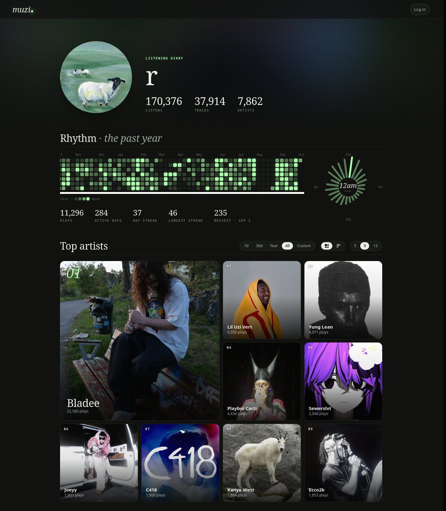
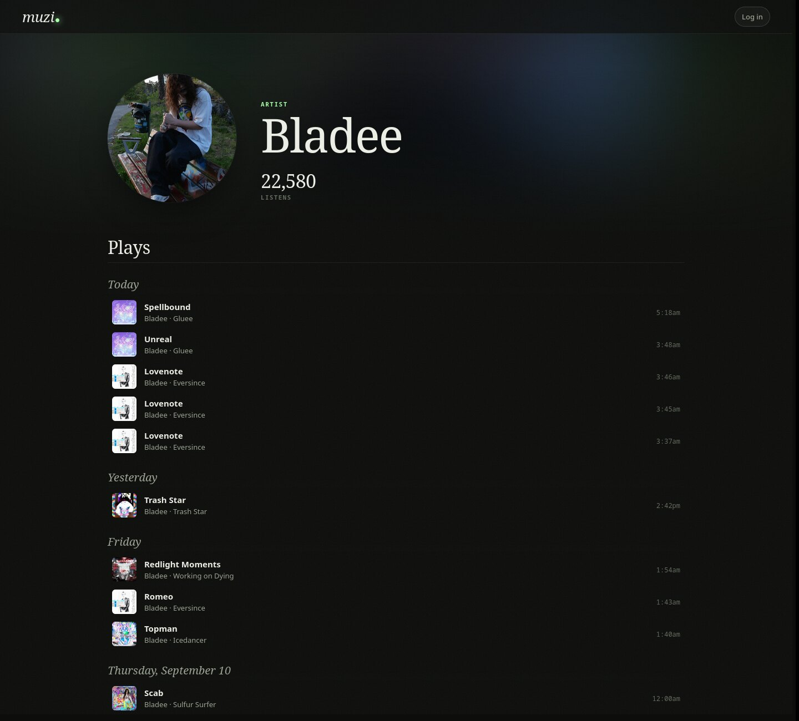
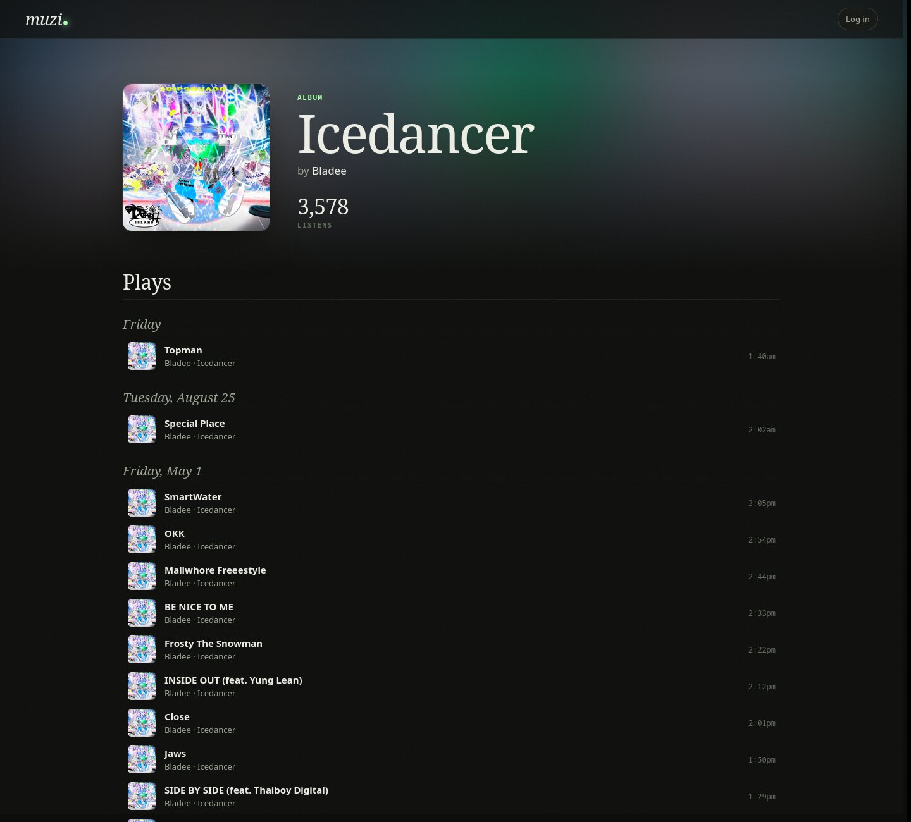
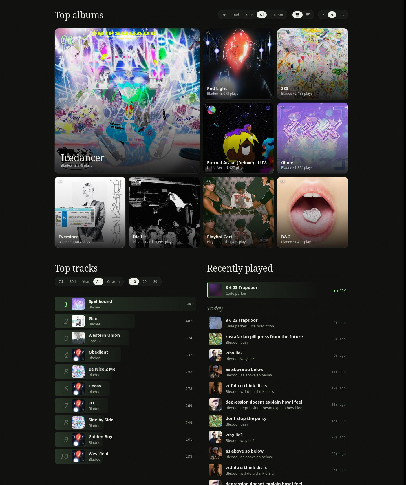
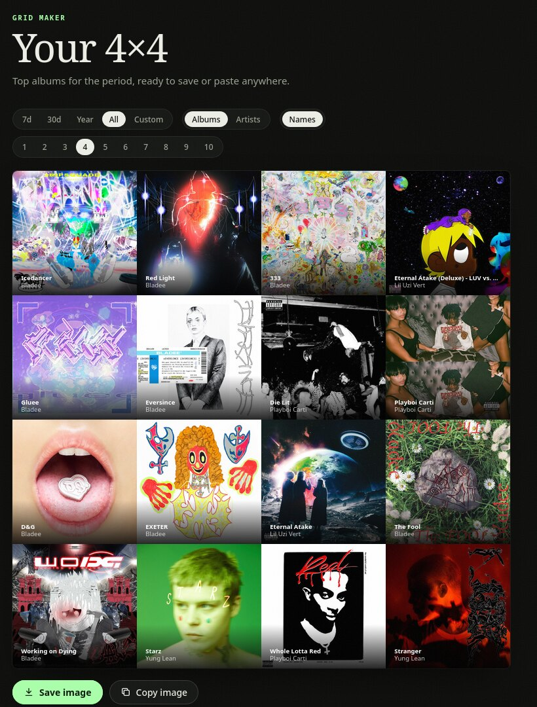
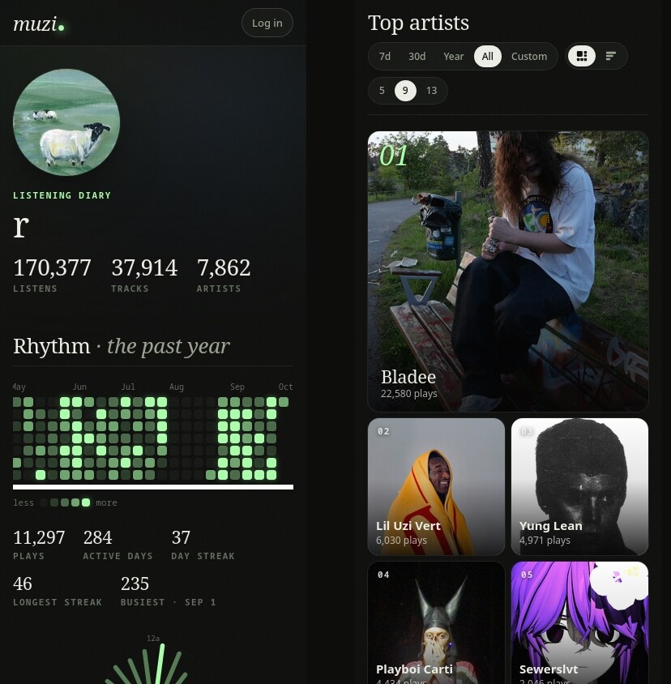

# muzi

**Self-hosted music listening statistics.** Import your history from Last.fm and Spotify, scrobble live from your players, and browse it all in a fast, lightweight web UI. It's server-rendered Go with no frontend framework.



## Features

- **Imports:** your full history from Last.fm (via the API) and Spotify (from your data export). Re-running an import only adds what's missing.
- **Live scrobbling:** Last.fm-compatible and ListenBrainz-compatible endpoints, plus Spotify playback polling. Players show up as **now playing**.
- **Profile:** top artists, albums and tracks for any period, including custom date ranges, shown as a mosaic or a ranked chart.
- **Rhythm:** a year-long heatmap of daily plays, a 24-hour listening clock, and listening streaks.
- **Grid maker:** an N×N collage (1×1 up to 10×10) of your top albums or artists for any period. Save it as a PNG or copy it to your clipboard in one click.
- **Artwork:** artist, album and track images are fetched automatically from Spotify (if you add credentials) or Deezer. Upload your own to override any of them.
- **Search:** press `/` or `Ctrl+K` anywhere to search your library and other people's public profiles.
- **Editing:** rename artists, albums and tracks, add plays by hand, and select any number of plays to fix their title, artist or album, or delete them, in one go. Multi-artist tracks are split into their artists.
- **Profile customization:** upload and crop a profile picture, write a bio, and choose whether your profile is public. Profiles are private until you share them.
- **Mobile:** the UI works on phones as well as desktop.

## Screenshots

| Artist | Album |
|---|---|
|  |  |



<p align="center"></p>

<p align="center"></p>

## Requirements

- Go 1.25+
- PostgreSQL

## Getting started

```sh
git clone https://github.com/riwiwa/muzi.git
cd muzi
go run main.go
```

muzi creates its database and tables on first start. The web UI runs on port 1234 by default. Open http://localhost:1234 and create an account. After the first account exists, signup is closed unless you set `allow_signup = true`.

muzi reads `config.toml`, `templates/` and `static/` from its working directory, so run it from the repository folder.

### Resetting a password

If someone is locked out, run this from the muzi folder:

```sh
muzi reset-password <username>   # or: go run main.go reset-password <username>
```

It prints a new random password and logs that user out everywhere. Users can change their own password under **Settings → Account**.

## Configuration

`config.toml` (all fields optional; these are the defaults):

```toml
[server]
address = "0.0.0.0:1234"
# Public URL, if muzi is behind a reverse proxy; used for the Spotify redirect URI
# public_url = "https://muzi.example.com"
# Let anyone who can reach the server create an account (the first account is always allowed)
allow_signup = false

[database]
host = "localhost"
port = "5432"
user = "postgres"
password = "postgres"
name = "muzi"

[images]
# Fetch missing artist/album/track images automatically
auto_fetch = true
```

## Importing your history

Under **Settings → Import**:

- **Last.fm:** your Last.fm username and an [API key](https://www.last.fm/api/account/create).
- **Spotify:** the `Streaming_History_Audio_*.json` files from your [Spotify data export](https://www.spotify.com/account/privacy/). Request the **Extended streaming history** export; the basic account-data export doesn't include full play history.

## Scrobbling

Generate an API key under **Settings → Scrobbling**, then point your scrobbler at one of these endpoints:

| Protocol | Endpoint |
|---|---|
| ListenBrainz | `http://<host>:1234/1/submit-listens` (API key as the token) |
| Last.fm compatible | `http://<host>:1234/2.0/` (your muzi username, with the API key as the password) |

For **MPD**, [listenbrainz-mpd](https://codeberg.org/elomatreb/listenbrainz-mpd) works out of the box:

```toml
# ~/.config/listenbrainz-mpd/config.toml
[submission]
token = "<your muzi API key>"
api_url = "http://127.0.0.1:1234"

[mpd]
address = "127.0.0.1:6600"
```

For **Spotify**:
1. Create an app at [developer.spotify.com](https://developer.spotify.com/dashboard).
2. Add the redirect URI shown under **Settings → Scrobbling** to the app.
3. Save the app's client ID and secret in muzi, then click **Connect Spotify**.

The credentials alone are enough for Spotify artwork; connecting is only needed to scrobble your Spotify playback.

## Roadmap:
- Ability to import all listening statistics and scrobbles from: \[In Progress\]
    - LastFM \[Complete\]
    - Spotify \[Complete\]
    - Apple Music \[Planned\]

- WebUI \[In Progress\]
    - Full listening history with time \[Complete\]
    - Daily, weekly, monthly, yearly, lifetime presets for listening reports \[In Progress\]
    - Ability to specify a certain point in time from one datetime to another to list data \[In Progress\]
    - Grid maker (3x3-10x10) \[Complete\]
    - Ability to change artist and album images \[Complete\]
- Multi artist scrobbling \[Complete\]
- Live scrobbling to the server (With Now playing status) \[Complete\]
- Batch scrobble editor
